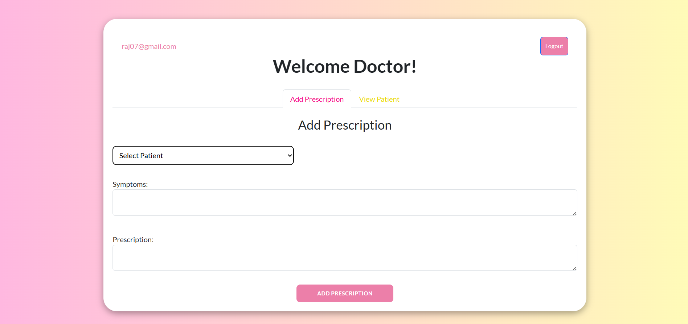

# Clinic Management System

The **Clinic Management System** is a web-based application designed to streamline operations in a clinic. It facilitates seamless interaction between receptionists and doctors while managing patient records, prescriptions and billing. The system is built with **HTML**, **CSS**, **JavaScript** and leverages **Firebase** for backend services.

---

## Architecture

### 1. Frontend (Client-Side Application)
The client-side application is responsible for user interaction and comprises the following modules:
- **Receptionist Module:**
  - Register patients with personal details.
  - System assigns sequential token numbers to the patients.
  - Generate bills.
  - View patient records.
- **Doctor Module:**
  - Access patient details using token numbers.
  - Add prescriptions and symptoms for patients.
  - View patient medical history for informed decision-making.
- **Shared Features:**
  - Both receptionist and doctor can view patient history.

### 2. Backend (Firebase Services)
The system uses Firebase for backend services:
- **Firebase Authentication:**
  - Manages user roles (Receptionist, Doctor).
  - Secures data access and ensures role-based permissions.
- **Firebase Firestore (Database):**
  - Stores:
    - Patient information (name, age, address, contact details and token numbers).
    - Prescriptions (symptoms and medicines added by doctors).
    - Billing information.
  - Provides real-time updates for seamless interaction between the receptionist and doctor.
- **Firebase Hosting:**
  - Hosts the web application, ensuring global availability and fast response times.

---

## Workflow

### 1. Patient Registration (Receptionist)
- Receptionist enters patient details into the system.
- A sequential token number is assigned to the patient by the system.
- The patient record is stored in Firestore.

### 2. Prescription Entry (Doctor)
- Doctor accesses patient records by token number.
- Adds symptoms and prescriptions to the patient’s history.
- Updates are saved in Firestore and synchronized in real-time.

### 3. Bill Creation (Receptionist)
- Receptionist generates a bill.
- Amount is recorded and the bill is stored in Firestore.

### 4. View Patient History
- Both the receptionist and doctor can view patient history.
- History is fetched from Firestore for easy tracking of past visits.

---

## Illustrations

Home Page: Login

Home Page: Registration

Receptionist Registration

Receptionist Registration Success Confirmation

Receptionist Login

Adding Patient Details

Successful Addition of Patient and System Token Generation

Selecting Patient for Bill Generation

Patient Bill Generation Amount

Successful Bill Generation of First Patient

Receptionist Logout

Doctor Registration

Doctor Registration Success Confirmation

Doctor Login

Doctor's Add Prescription Page

Doctor Selecting Patient to Add Prescription

Doctor Adding Patient's Prescription

Confirmation for Adding Patient's Prescription

Doctor's View Patient History Page

Doctor Selecting Patient to View Patient History

Doctor's View of Patient History

Doctor Logout

Receptionist's View Patient History Page

Receptionist Selecting Patient to View Patient History

Receptionist's View of Patient History

Receptionist Logout

Firebase User Authentication

User Receptionist in Firestore Database

User Doctor in Firestore Database

Patient Data in Firestore Database

Bill Generation of Patient in Firestore Database

---

## Security and Access Control
- **Role-Based Access:**
  - Receptionist: Register patients, view patient records and generate bills.
  - Doctor: Add prescriptions and view patient records.
- **Firestore Security Rules:**
  - Restrict read and write access based on the user’s role and authentication status.

---

## Key Advantages
1. **Scalability:**
   - Firebase’s serverless architecture automatically scales with the clinic’s needs.
2. **Real-Time Updates:**
   - Firestore ensures updated records are visible instantly.
3. **Modularity:**
   - Clear separation of responsibilities between receptionist and doctor.
4. **Ease of Deployment:**
   - Firebase Hosting makes the application globally accessible with minimal effort.
5. **Data Consistency:**
   - Using `serverTimestamp` ensures reliable and consistent timestamps.

---

## Future Enhancements
This architecture is designed to be flexible and scalable, allowing for potential future features such as:
- Appointment scheduling.
- Notifications for patients and staff.
- Advanced analytics for patient and clinic performance insights.
